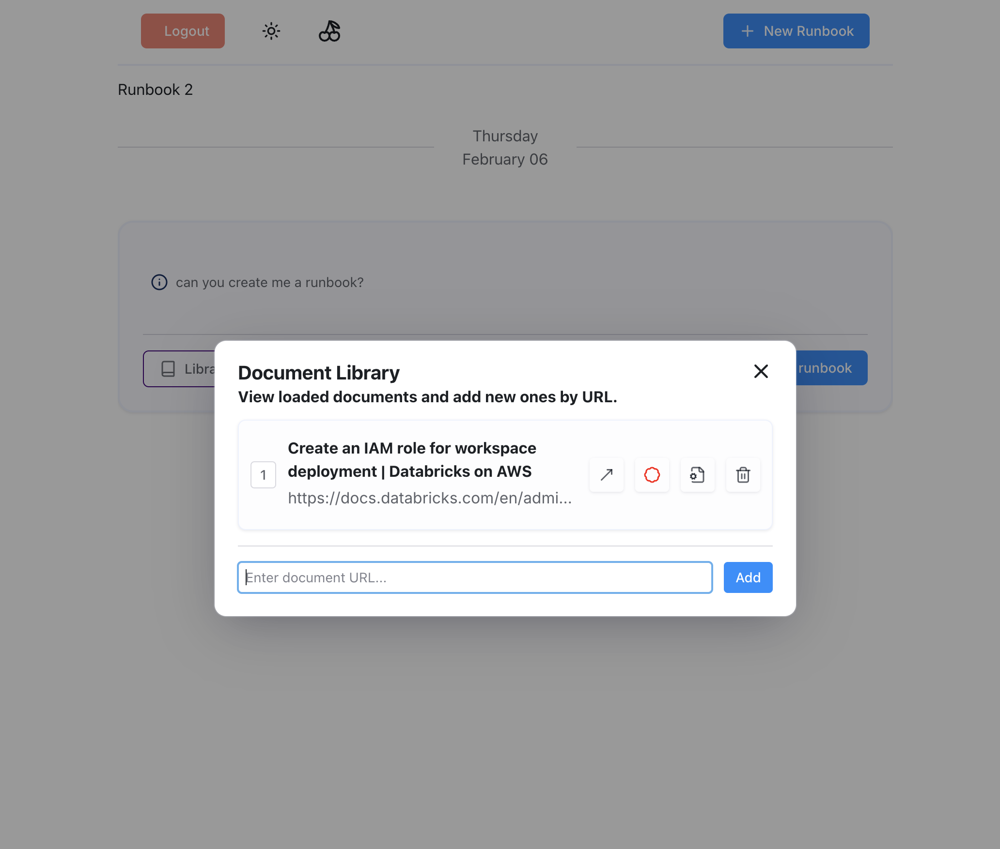

# runbook app



Using chat template for now from:


# to run

setup ollama or some OAI compat endpoint. If running remote, use port forwarding to allow access.

For me I am running remote so use:

```
ssh -L 11434:localhost:11434 -N pphoebe
```